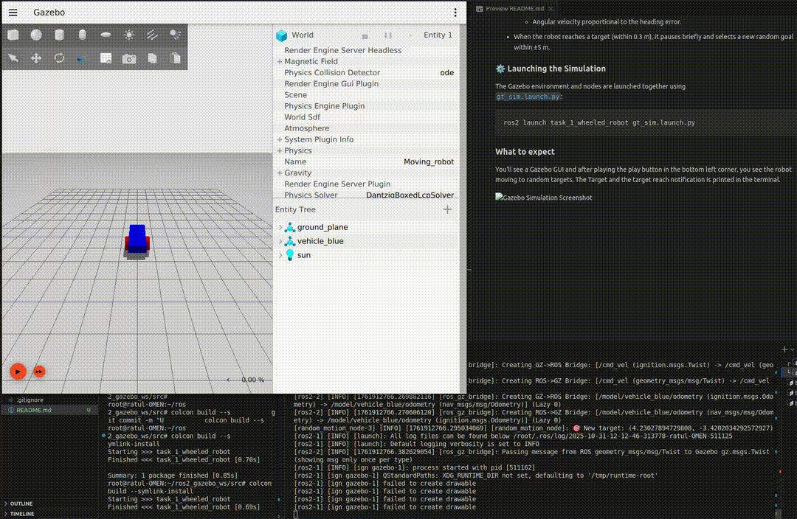

## 🧩 Installation & Setup

This project is fully configured to run inside a **VS Code Dev Container**, ensuring a consistent development environment with all dependencies preinstalled (ROS 2, Gazebo, and Python packages).

### 🚀 Steps to Launch

1. **Open the project in VS Code**
   ```bash
   code ROS2_GAZEBO_EKF
   ```

2. **Reopen in Dev Container**
   - When prompted by VS Code, click **“Reopen in Container”**.  
   - Alternatively, open the Command Palette (`Ctrl+Shift+P` or `Cmd+Shift+P` on macOS) and run:
     ```
     Dev Containers: Reopen in Container
     ```

3. **Wait for the container to build**
   The first build may take a few minutes as it installs ROS 2, Gazebo, and all required Python dependencies.

4. **Verify setup**
   Once the container starts, check that ROS 2 is correctly installed:
   ```bash
   ros2 --version
   ```

✅ You’re now ready to run the simulation, EKF notebook, and all ROS 2 nodes directly from inside the container.


## 🦾 Task 1: Simulated Robot Environment

This task demonstrates a **differential drive robot** moving autonomously inside a Gazebo world.  
The robot is modeled using SDF and controlled through ROS 2 using velocity commands (`/cmd_vel`).  
A simple proportional controller drives the robot toward random target points in the environment.

### 🧱 World & Robot Description

The simulation world is defined in [`world.sdf`](src/task_1_wheeled_robot/world/world.sdf), containing:
- A **flat ground plane** and a **blue rectangular robot** model with two red driving wheels and a green caster wheel.
- A **diff-drive plugin** (`libignition-gazebo-diff-drive-system.so`) to convert velocity commands into wheel rotations.
- (Not used) **Keyboard plugins** for optional manual teleoperation (arrow keys to move/rotate).
- A **directional light** and basic physics configuration.

The simulation world is defined in [`world.sdf`](src/task_1_wheeled_robot/world/world.sdf).

#### Robot Model: `vehicle_blue` (diff-drive with caster)
- **Links**
  - **`chassis`**: blue box (size **2.0 × 1.0 × 0.5 m**), mass **1.14395 kg**, custom inertia. Posed at `0.5 0 0.4` relative to model.
  - **`left_wheel`**: red cylinder (radius **0.4 m**, length **0.2 m**), mass **2 kg**. Pose: `-0.5 0.6 0` with roll **−π/2**.
  - **`right_wheel`**: red cylinder (radius **0.4 m**, length **0.2 m**), mass **1 kg**. Pose: `-0.5 -0.6 0` with roll **−π/2**.
  - **`caster`**: green sphere (radius **0.2 m**), mass **1 kg**. Mounted via `caster_frame` at `0.8 0 -0.2` from chassis.

- **Joints**
  - **`left_wheel_joint`** & **`right_wheel_joint`**: **revolute** about the local **Y** axis (continuous limits set via ±∞).
  - **`caster_wheel`**: **ball** joint (free caster).

- **Drive & Sensing**
  - **Plugin**: `ignition::gazebo::systems::DiffDrive`
    - `wheel_separation`: **1.2 m**
    - `wheel_radius`: **0.4 m**
    - `topic`: **`cmd_vel`** (Twist)
    - `odom_publish_frequency`: **10 Hz**
  - **Control interface**: ROS 2 publishes to **`/cmd_vel`** → Gazebo diff-drive consumes it.
  - **Odometry**: Gazebo publishes **`/model/vehicle_blue/odometry`** (bridged to ROS 2).

- **Visuals & Collisions**
  - Each link has matching **visual** and **collision** geometry (box/cylinder/sphere), ensuring physically consistent contact.

### 🤖 Robot Control Node

The motion behavior is implemented in [`random_motion_node.py`](src/task_1_wheeled_robot/ros_nodes/random_motion_node.py).

- The node subscribes to `/model/vehicle_blue/odometry` to receive the robot’s position and orientation.
- It publishes velocity commands on `/cmd_vel`.
- A **simple proportional controller** computes:
  - Linear velocity proportional to the distance from the current position to the target.
  - Angular velocity proportional to the heading error.
- When the robot reaches a target (within 0.3 m), it pauses briefly and selects a new random goal within ±5 m.

### ⚙️ Launching the Simulation

The Gazebo environment and nodes are launched together using  
[`gt_sim.launch.py`](src/task_1_wheeled_robot/launch/gt_sim.launch.py):

```bash
ros2 launch task_1_wheeled_robot gt_sim.launch.py
```

### What to expect

You'll see a Gazebo GUI and after playing the play button in the bottom left corner, you see the robot moving to random targets. The Target and the target reach notification is printed in the terminal.




## 🧮 Task 2: Extended Kalman Filter (EKF)

Find the implementation, description and the result [here](https://github.com/ratulKabir/ros2_gazebo_ws/blob/main/src/task_1_wheeled_robot/task_1_wheeled_robot/core/ekf.ipynb).


## 🧭 Task 3 — Integrated Localization in a Noisy Environment

This task demonstrates **localization under measurement noise** using an **Extended Kalman Filter (EKF)** integrated with a differential-drive robot in Gazebo.  
The goal is to compare **raw noisy odometry** against **EKF-filtered estimates** in real time while the robot navigates randomly toward dynamically generated targets.

---

### 🚀 Launching the Simulation

You can toggle the EKF filtering using the `use_ekf` flag:

```bash
# Run without EKF (only noisy odometry)
ros2 launch task_1_wheeled_robot ekf_sim.launch.py use_ekf:=false

# Run with EKF filtering enabled
ros2 launch task_1_wheeled_robot ekf_sim.launch.py use_ekf:=true
```

The launch file:
- Starts the **Gazebo world** (`world.sdf`)  
- Bridges Gazebo topics (`/cmd_vel`, `/odometry`) to ROS 2  
- Launches the following nodes:  
  - `noise_injector_node` — adds Gaussian noise to the ground-truth odometry  
  - `ekf_node` — fuses motion commands and noisy odometry to estimate a clean pose  
  - `motion_node` — drives the robot toward random targets  
  - `live_plotter` — visualizes trajectories in real time  

---

### 🧩 Node Overview

| Node | Purpose | Key Topics |
|------|----------|------------|
| **`noise_injector_node`** | Adds Gaussian noise to Gazebo odometry (position, yaw, and velocity) | Sub: `/model/vehicle_blue/odometry` → Pub: `/odom_noisy` |
| **`ekf_node`** | Performs state estimation `[x, y, yaw]` using motion (`v`, `w`) and noisy measurements | Sub: `/odom_noisy`, `/cmd_vel` → Pub: `/ekf/odom` |
| **`motion_node`** | Generates control commands for random waypoint navigation | Sub: `/odom_noisy` or `/ekf/odom` → Pub: `/cmd_vel`, `/target_point` |
| **`live_plotter`** | Real-time Matplotlib visualization comparing ground truth, noisy, and EKF trajectories | Sub: `/model/vehicle_blue/odometry`, `/odom_noisy`, `/ekf/odom`, `/target_point` |

---


### 📈 Live Visualization

The **`live_plotter`** node shows trajectories in real time:  
- 🟢 Ground Truth  
- 🔴 Noisy Odometry  
- 🔵 EKF Estimate  
- ✖️ Target Points  

The plot remains centered around the ego vehicle with a fixed ±5 m viewing window.  

---

### 🧪 Expected Behavior

- When **`use_ekf:=false`**, the robot’s real taken trajectory (green) drifts due to accumulated noise.  


- When **`use_ekf:=true`**, the EKF estimate (blue) improves the robot navigation resulting in a better taken trajectory (green), demonstrating improved localization accuracy and smoother motion.  

